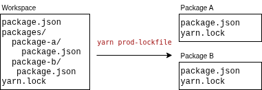

# yarn-plugin-prod-lockfiles

Yarn Berry plugin that generates production-only `docker.yarn.lock` and `docker.package.json` for a focused workspace — useful for lean Docker image builds where each image should install only dependencies needeed by the workspace package while perserving immutability of yarn.lock files allowing for --immutable.



## Install

Install the yarn plugin:

```
yarn plugin import https://raw.githubusercontent.com/dee-gmiterko/yarn-plugin-prod-lockfiles/main/bundles/@yarnpkg/plugin-prod-lockfiles.js
```

## Usage

```
yarn prod-lockfile --focus <workspace> [--wrap-package-name <name>] [--workspace-version <version>] [--output <file>] [--output-package-json <file>]
```

### Flags

**`--focus`** _(required)_
The workspace to generate the lockfile for, e.g. `@my-org/api`.

**`--wrap-package-name`** _(optional)_
When provided, generates a synthetic wrapper package that lists the focused workspace as its dependency. Useful when your packages are published to a (private) registry. When omitted, the focused workspace package itself is stripped and used.

**`--workspace-version`** _(optional, default: `1.0.0`)_
Version used for workspace packages in the generated lockfile and package.json.

**`--output-yarn-lock`** _(optional, default: `<workspace-path>/docker.yarn.lock`)_
Output path for the generated lockfile.

**`--output-package-json`** _(optional, default: `<workspace-path>/docker.package.json`)_
Output path for the generated package.json.

### Examples

**No-wrap mode** — focused workspace is the root. `docker.package.json` mirrors the focused workspace's production deps:

```
yarn prod-lockfile --focus @my-org/api
```

Generated `docker.package.json`:
```json
{
  "name": "@my-org/api",
  "dependencies": {
    "express": "^5.0.0"
  }
}
```

At this point we dont solve the problem of how are you gonna install other workspace packages in this mode, may require further work.

---

**Wrap mode** — synthetic wrapper package is the root, focused workspace is its dependency. Use when packages are published to a registry:

```
yarn prod-lockfile --focus @my-org/api --wrap-package-name @my-org/api-run
```

Generated `docker.package.json`:
```json
{
  "name": "@my-org/api-run",
  "dependencies": {
    "@my-org/api": "npm:1.0.0"
  }
}
```

## How it works

The plugin traverses the full transitive production dependency graph starting from the focused workspace. Workspace-to-workspace dependencies are rewritten as `npm:<version>` entries so they can be resolved from a registry in Docker — where the `workspace:` protocol is not available.

- Skips `devDependencies` and `@types/*` packages

## Dockerfile example

```dockerfile
FROM node:22-alpine AS deps

WORKDIR /app

COPY packages/api/docker.package.json ./package.json
COPY packages/api/docker.yarn.lock ./yarn.lock

RUN yarn install --immutable
```
